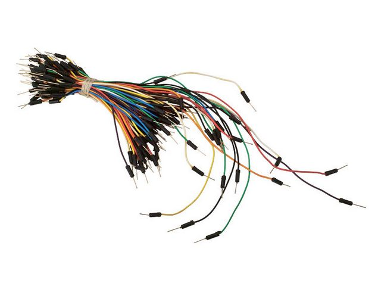

# Indoor plant monitoring with a RP2

## Introduction

My name is Eric Weidow and I am an Electrical Engineering student at LTH in Lund, Sweden. As I wanted more practical experience with electronics and programming, I signed up for a summer course in Applied IoT a Linnaeus University (student credentials: ew223me), Sweden, and this project is part of that course.

The project is made up of a Raspberry Pi Pico WH (henceforth called **RP2**) with two sensors to measure air temperature, air humidity, and the soil moisture for an indoor plant. The data is sent via Wi-Fi to [AdafruitIO](https://io.adafruit.com/) using the MQTT protocol. The data is stored to my Adafruit account and displayed using a dashboard.

The goal of this project is being able to visualize and predict the soil humidity for an indoor plant, and notify the user when the plant should be watered. As both air temperature and air humidity is measured, the goal is that the prediction of when the plant needs to be watered can be improved based on this data. I will use this IoT device as a way for reminding me when to water my plants, as I have always been bad at taking care of them. Additionally, it will give me a great amount of experience with:

- IoT concepts and principles
- Microcontrollers and sensors
- Connecting to WiFi using code 
- The MQTT protocol
- Creating automatic reconnection to WiFi and MQTT brokers
- _...and much more!_

In total, it should take about 3-4 hours to complete the project if this tutorial is followed.

<!--
Give a short and brief overview of what your project is about.
What needs to be included:

- [x] Title
- [x] Your name and student credentials (xx666x)
- [x] Short project overview
- [x] How much time it might take to do (approximation)
-->

<!--
Describe why you have chosen to build this specific device. What purpose does it serve? What do you want to do with the data, and what new insights do you think it will give?

- [x] Why you chose the project
- [x] What purpose does it serve
- [x] What insights you think it will give

-->

&nbsp;

## Tutorial

<!-- Please keep the total length of the tutorial below 25k characters. You can include code that is linked to a repository. Keep the code snippets in the tutorial short. -->

### Materials

The materials used in this project are shown in Table 1, below. In addition, costs (in SEK), links to the products from the Swedish reseller Electrokit, and images are also shown in the table:

<div align="center">
    <h6>
        <b>Table 1</b>. The material list. Costs, links to where the products can be bought and images for each product is included below. Data received from the <a href="https://www.electrokit.com/">Electrokit</a> website.
    </h6>

| Material                               | Cost    | Link                                                                                                     | Image                                                    |
| -------------------------------------- | ------- | -------------------------------------------------------------------------------------------------------- | -------------------------------------------------------- |
| Raspberry Pi Pico WH                   | 109 SEK | <a href="https://www.electrokit.com/produkt/raspberry-pi-pico-wh/">here</a>                              |        |
| DHT11 Temperature & Humidity Sensor    | 49 SEK  | <a href="https://www.electrokit.com/produkt/digital-temperatur-och-fuktsensor-dht11/">here</a>           |                |
| FC-28 Soil Moisture Sensor             | 29 SEK  | <a href="https://www.electrokit.com/produkt/jordfuktighetssensor/">here</a>                              |  |
| Breadboard (a smaller size works fine) | 69 SEK  | <a href="https://www.electrokit.com/produkt/kopplingsdack-840-anslutningar/">here</a>                    |                  |
| Wires                                  | 39 SEK  | <a href="https://www.electrokit.com/produkt/kopplingstrad-byglar-for-kopplingsdack-mjuka-65st/">here</a> |                      |

</div>

Some comments about the materials used:
- **Raspberry Pi**: The Raspberry Pi Pico W will henceforth be called the RP2, which is a common notation for a Raspberry Pi Pico with a 2040 chip.
- **DHT11** and **FC-28**: A more detailed explanation of these sensors are included in sections [DHT11](#dht11-temperature--humidity-sensor) and [FC-28](#fc-28-soil-moisture-sensor). More detail about how they are used is in the section [Putting everything together](#putting-everything-together).
- **Breadboard**: Any breadboard big enough for the components is fine. The one linked is simply the one I used.
- **Wires**: The absolute minimum of wires is 6 wires with a male-male connection, but I recommend at least 8. 2 female-female wires were included when buying the FC-28 sensor, but another soil moisture sensor may require buying your own female-female wires. 

<!--
> Explain all material that is needed. All sensors, where you bought them and their specifications. Please also provide pictures of what you have bought and what you are using.
>
> - [x] List of material
> - [x] What the different things (sensors, wires, controllers) do - short specifications
> - [x] Where you bought them and how much they cost
>
> 
> Fig. 1. LoPy4 with headers. Pycom.io

-->

#### DHT11 Temperature & Humidity Sensor

The DHT11 Temperature & Humidity Sensor is a cheap but reliable sensor with a digital signal output.

Datasheets recommended voltages V<sub>dd</sub> from 3.3 V to 5 V to be used as power for the DHT11. Measurement specifications are included in Table 2, below.

<div align="center">
    <h6>
        <b>Table 2</b>. RH = Relative Humidity, the amount of vapor present in air expressed as a percentage (%RH) of what is required to achieve saturation at the same temperature. Data received from the <a href="https://www.electrokit.com/uploads/productfile/41015/DHT11.pdf">DHT11 datasheet</a> on the <a href="https://www.electrokit.com/produkt/digital-temperatur-och-fuktsensor-dht11/">DHT11 product page</a>.
    </h6>

| Measurement Range | Humidity Accuracy | Temperature Accuracy | Resolution            |
| ----------------- | ----------------- | -------------------- | --------------------- |
| 20-90%RH          | &plusmn;5%RH      | &plusmn;2 &deg;C     | Humidity: 1%RH        |
| 0-50 &deg;C       |                   |                      | Temperature: 1 &deg;C |

</div>

Worth noting is that datasheets recommended not sending any instructions to the sensor in within one second of supplying power to it, to pass the unstable status. This should be considered when implementing the code for the sensor.

#### FC-28 Soil Moisture Sensor

The FC-28 Soil Moisture Sensor measures the resistance between the two exposed pads. This is converted to a voltage (0 to V<sub>CC</sub>) which can be measured by a microcontroller to determine the moisture of the soil.

The sensor requires an input voltage V<sub>CC</sub> of 3.3-5 V. The voltage measured by the sensor is availible on two different pinouts:

- The `AO` (Analog output) pinout can be measured to get the sensor's analog voltage with a value between 0 and V<sub>CC</sub>.
- The `DO` (Digital output) pinout can be measured to get either 0 (`LOW`) or V<sub>CC</sub> (`HIGH`). The sensor has a chip with a comparator and a variable resistor. The variable resistor can then be rotated to choose when the `DO` pinout should be set to either `LOW` or `HIGH`.

In the [online user guide](https://www.electrokit.com/uploads/productfile/41015/41015738_-_Soil_Moisture_Sensor.pdf) supplied by Electrokit on the product page, it says:

> "As the probe passes current through the soil, it carries ions that will damage the surface layer over time. As such the sensor should not be operated permanently. Instead it should only be powered up when a measurement is taken and then instantly shut down again."

When using this sensor, it should therefore only recieve power a few seconds before taking a measurement. At all other times, it should be turned off to not damage it much over time. 


&nbsp;

### Computer setup

Make sure to go through every step of this setup so you don't miss downloading or installing anything.

<details>
    <summary><b>1. Setting up the IDE</b></summary></br>
    
For the IDE I chose VSCode. The steps to setup VSCode for Windows with the correct extension (Pymakr) are the following:

1. Download and install the LTS release of Node.js [from this link](https://nodejs.org/en).
2. Download and install VSCode [from this link](https://code.visualstudio.com/Download).
3. Open VSCode.
4. Open the **Extensions manager** from the left panel icon _OR_ press <kbd>Ctrl</kbd> + <kbd>Shift</kbd> + <kbd>X</kbd>.
5. Search for the **Pymakr** extension and install it.
</details>

<details>
    <summary><b>2. Flashing firmware to the RP2</b></summary></br>

With the IDE installed, the firmware now needs to be flashed to the RP2. Make sure you have your RP2 and cable for these steps:

1. Download the micropython firmware [from this link](https://micropython.org/download/rp2-pico-w/). Make sure that you download the latest firmware from `Releases`, and **not** from `Nightly builds`. You will get a `.uf2` file.
2. Connect the **micro-usb** end of the cable to the RP2. Firmly hold the back of the USB slot when connecting the cable. There will probably be a small gap even when fully inserted, this is normal.
3. While holding the <kbd>BOOTSEL</kbd> button on the RP2, connect the **USB type A** end of the cable to your computer. When you have connected the cable you can release the <kbd>BOOTSEL</kbd> button.
4. There should be a new drive on your file system named `RPI-RP2`. This is the RP2 storage. Copy the `.uf2` file you downloaded earlier into this storage. **Do not disconnect the device during this installation! If you do you will most likely need to redo the above steps of flashing the firmware.**
5. Your RP2 should now automatically disconnect and reconnect.
</details>

<details>
    <summary><b>3. Cloning and configuring the code from this repository</b></summary></br>
        
All code for this project is availible in this GitHub repository. Follow the steps below:

1. Find a place where you want to clone the code to. A folder will automatically be created when cloning code. But create a parent folder if you want to.
2. In VSCode, press <kbd>CTRL</kbd> + <kbd>SHIFT</kbd> + <kbd>P</kbd> to open the editor commands.
3. Write `Git: Clone` and choose `Git: Clone` when it shows up.
4. In the field which says `Provide repository URL or pick a repository source.`, copy and paste `https://github.com/Studsministern/1DT305-Applied-IoT-Project`. Press <kbd>ENTER</kbd>.
5. Navigate to where you want the folder with code to be cloned to. Press <kbd>Select as Repository Destination</kbd>.
6. When it has finished cloding, a window saying "Would you like to open the cloned repository, or add it to the current workspace?" will show up. Press <kbd>Open</kbd>.
7. Create a file called `env.py` and copy the contents of `env.py.example` into it. Then change the variable values to your WiFi credentials, MQTT variables, etc.

</details>

<details>
    <summary><b>4. Uploading the code to the RP2</b></summary></br>
    
Make sure the RP2 is connected to the computer. To upload the code to the RP2, you should already have the IDE installed and the firmware flashed. Then upload the code by following these steps:

1. In VSCode, open **Pymakr** from the left panel icon. Find the device and press `Connect device` (a small lightning symbol) and `Create terminal` (a box with a right arrow).
2. Find `PYMAKR: PROJECTS` in either **Pymakr** or **Explorer** on the left panel.
3. Press <kbd>ADD DEVICES</kbd> and select the device.
4. Press `Sync project to device` (a cloud with an upwards arrow).
5. If you want the file contents to automatically update as you do changes, find `PYMAKR: PROJECTS` again. Hold your mouse over the project. Press <kbd></></kbd> (`Start development mode`).
</details>

<!--
How is the device programmed. Which IDE are you using. Describe all steps from flashing the firmware, installing plugins in your favorite editor. How flashing is done on MicroPython. The aim is that a beginner should be able to understand.

- [x] Chosen IDE
- [x] How the code is uploaded
- [x] Steps that you needed to do for your computer. Installation of Node.js, extra drivers, etc.

-->


&nbsp;

### Putting everything together

In this project, only the parts already accounted for in the materials list is required. In Figure 1, below, a circuit diagram is shown. My reasoning for how I connected the DHT11 and FC-28 is also in the sections below.

#### Circuit diagram

<div align="center">
    
    <h6>
        <b>Figure 1</b>. A circuit diagram identical to the real circuit. The circuit contains a Raspberry Pi Pico WH (left), a DHT11 sensor (middle) and a FC-28 sensor (right) connected with wires Diagram made in <a href="https://fritzing.org/">Fritzing</a> version 0.9.3b.
    </h6>
</div>

#### DHT11
For the DHT11 I chose a voltage of V<sub>dd</sub> = 3.3 V, as recommended by the datasheets, which is supplied by pin 36 (`3V3(OUT)`) on the RP2. The version of the DHT11 I bought includes a 10 k&Omega; pullup resistor, which means no extra resistor will be needed in the circuit.

The connection of the DHT11 to the RP2 can be seen in the circuit diagram above. The signal pin on the DHT11 is connected to pin 31 (`GP26`) on the RP2 to take measurements.

#### FC-28

For the FC-28 I also chose a supply voltage of V<sub>CC</sub> = 3.3 V. However, I don't use the `3V3(OUT)` pin for this purpose. As mentioned previously, keeping the sensor powered on will damage it. Instead I investigated using a GPIO to supply power to the sensor:

Before testing with a GPIO pin I supplied power with the `3V3(OUT)` pin. By using a multimeter, I was able to measure that the V<sub>CC</sub> pin on the sensor received a current of 2.9 mA. There does not appear to be any official documentation of how much current a GPIO pin is allowed to use. However, discussions in many forums suggest 16 mA to be the absolute max current from any one pin, and that the GPIO pins were designed for a current draw of at least 3 mA.

Therefore I used pin 32 (`GP27`) as a digital output pin to provide the supply voltage to the FC-28. The advantage of this is that the sensor can be kept on for just a few seconds during each measurement, to prolong the lifespan of the FC-28. I chose to keep the sensor active for 2 seconds before taking a measurement. However, I am unsure if this is the best value to use when both the lifetime of the sensor and the accuracy of the measurements is taken into account.

The measurement is done with pin 34 (`ADC2`, occupying the same pin as `GP28`) on the RP2, which is connected to the `AO` pinout on the FC-28, see the circuit diagram above. The ADC (Analog-Digital Converter) in the RP2 converts the 0-3.3 V voltage to a 16-bit number, between 0 and 65535. 0 corresponds to very low resistance (high moisture) and 65535 corresponds to very high resistance (low moisture). The read value is translated to a moisture percentage using the following equation:

```math
    \text{Moisture percentage} = 100 - \frac{\text{read value} \cdot 100}{65535}    
```

The percentage is as arbitrary as the read value. However, it is more intuitive to figure out at what moisture percentage the plant needs to be watered at, instead of at what 16-bit number it should be watered. 

<!--
How is all the electronics connected? Describe all the wiring, good if you can show a circuit diagram. Be specific on how to connect everything, and what to think of in terms of resistors, current and voltage. Is this only for a development setup or could it be used in production?

- [x] Circuit diagram (can be hand drawn)
- [x] \*Electrical calculations

Adding Pico W in fritzing: https://datasheets.raspberrypi.com/picow/PicoW-Fritzing.fzpz
-->


&nbsp;

### Platform

<!--
Describe your choice of platform. If you have tried different platforms it can be good to provide a comparison.

Is your platform based on a local installation or a cloud? Do you plan to use a paid subscription or a free? Describe the different alternatives on going forward if you want to scale your idea.

- [ ] Describe platform in terms of functionality
- [ ] \*Explain and elaborate what made you choose this platform
-->


&nbsp;

### The code

As mentioned in [Materials](#materials), instructions should not be sent to the DHT11 sensor in within one second of supplying power to it, to pass the unstable status. As my code connects the RP2 to WiFi and the MQTT broker before measuring any values, this is not a problem.

<!--
Import core functions of your code here, and don't forget to explain what you have done! Do not put too much code here, focus on the core functionalities. Have you done a specific function that does a calculation, or are you using clever function for sending data on two networks? Or, are you checking if the value is reasonable etc. Explain what you have done, including the setup of the network, wireless, libraries and all that is needed to understand.

```python=
import this as that

def my_cool_function():
    print('not much here')

s.send(package)

# Explain your code!
```

https://pypi.org/project/micropython-mpy-env/ used to handle .env variables

Using JSON files in Python: https://www.geeksforgeeks.org/read-json-file-using-python/
Using 'dict' in Python, reading values based on a key: https://realpython.com/python-dicts/#accessing-dictionary-values
Using importing in micropython. Importing from files in another folder: https://learn.adafruit.com/micropython-basics-loading-modules/import-code
Using try-except in Python: https://www.w3schools.com/python/python_try_except.asp
-->

The file structure is:

```graphql
boot.py          - # Runs on startup
main.py          - # Runs when boot is completed
env.py           - # Containing environment variables
env.py.example   - # Example for environment variables
lib/*            - # Library files
├─ __init.py__   - # Init file to allow importing from lib
├─ mqtt.py       - # Library for creating an MQTTClient
└─ wifi.py       - # Handling connection to WiFi
pymakr.conf      - # Pymakr configuration file
```


&nbsp;

### Transmitting the data / connectivity

<!--
How is the data transmitted to the internet or local server? Describe the package format. All the different steps that are needed in getting the data to your end-point. Explain both the code and choice of wireless protocols.

- [ ] How often is the data sent?
- [ ] Which wireless protocols did you use (WiFi, LoRa, etc ...)?
- [ ] Which transport protocols were used (MQTT, webhook, etc ...)
- [ ] \*Elaborate on the design choices regarding data transmission and wireless protocols. That is how your choices affect the device range and battery consumption.
-->


&nbsp;

### Presenting the data

<!--
Describe the presentation part. How is the dashboard built? How long is the data preserved in the database?

- [ ] Provide visual examples on how the dashboard looks. Pictures needed.
- [ ] How often is data saved in the database.
- [ ] \*Explain your choice of database.
- [ ] \*Automation/triggers of the data.
-->


&nbsp;

### Finalizing the design

#### Final design

#### Conclusion
The code is very forgiving, as it will continue trying to reconnect to WiFi and MQTT brokers until it succeeds, and because it will automatically disconnect from WiFi and the MQTT broker before going to sleep. The circuitry is also extremely simple, as it doesn't require any extra components other than the microcontroller and the sensors themselves. Because of how the code and circuitry turned out, I am very satisfied with this project. It has taught me a lot, and I believe it provides a great starting point for further development.

#### Further improvements
Some suggestions for improvements are:
- Connecting all electronics on a small experimental board or custom made PCB, and 3D-print a case for it. The FC-28 sensor probe and the micro-USB cable would then be connected to this case.
- Using batteries for power.
- Using subscription to be able to change delays or other settings from a dashboard.
- Using the soil moisture information to automatically trigger watering of plants.

<!--
Show the final results of your project. Give your final thoughts on how you think the project went. What could have been done in an other way, or even better? Pictures are nice!

- [ ] Show final results of the project
- [ ] Pictures
- [ ] \*Video presentation
-->


&nbsp;

---

## Useful links

- [DHT11 sensor example for RP2](<https://github.com/iot-lnu/applied-iot/tree/master/Raspberry%20Pi%20Pico%20(W)%20Micropython/sensor-examples/P5_DHT_11_DHT_22>)
- [FC-28 sensor example for Arduino](https://lastminuteengineers.com/soil-moisture-sensor-arduino-tutorial/)
- [Measuring from the analog pins on RP2](https://pycopy.readthedocs.io/en/latest/rp2/quickref.html#adc-analog-to-digital-conversion)
