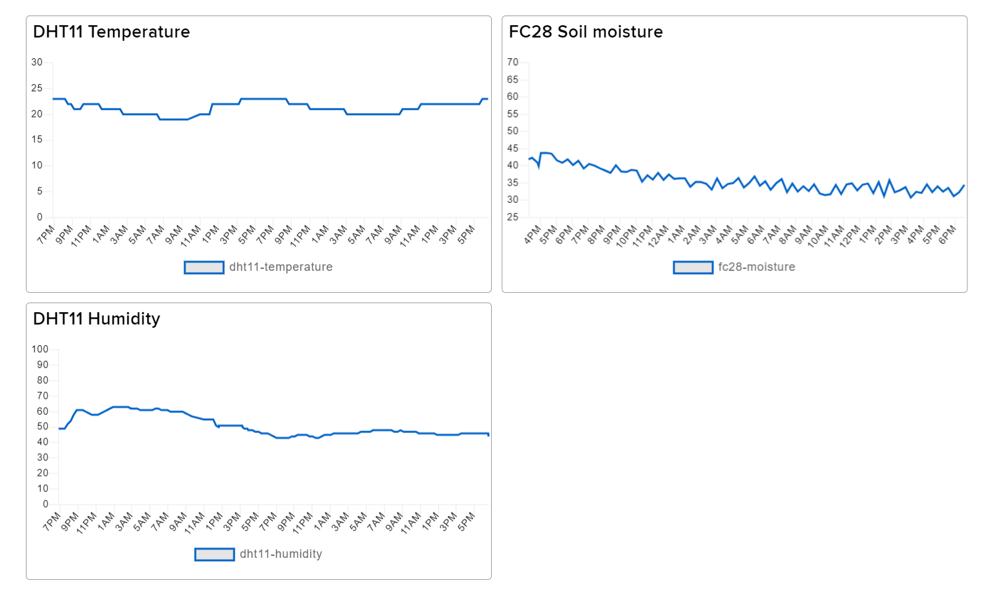

# Indoor plant monitoring with a RP2

## Introduction

My name is Eric Weidow, and this project is a part of the Applied IoT summer course at Linnaeus University (student credentials: ew223me), Sweden. My goal with this project is to monitor and indoor plant and send a notification when the plant needs to be watered. It will be used to remind to to water my plants, as I have always been bad at taking care of them. Additionally, it gives me a great amount of expericene with IoT, microcontrollers, sensors, Python, and much more!

My implementation uses a Raspberry Pi Pico WH (henceforth called **RP2**) with two sensors to measure air temperature, air humidity, and the soil moisture for an indoor plant. The data is sent via Wi-Fi to [Adafruit IO](https://io.adafruit.com/) (AIO) using the MQTT protocol. The data is stored in the Adafruit IO account and displayed using a dashboard. A Adafruit IO Reactive Action is used to send a notification when the soil moisture is below a set threshold. 

**Approximate build time**: 3-4 hours


&nbsp;

## Tutorial

### Materials

<div align="center">
    <h6>
        <b>Table 1</b>. The material list. Clicking the name of the materials links to the product page on the <a href="https://www.electrokit.com/">Electrokit</a> website. Costs and images are taken from the respective product pages.
    </h6>

| Material                                                                                                                         | Cost    | Image                                                    |
| -------------------------------------------------------------------------------------------------------------------------------- | ------- | -------------------------------------------------------- |
| <a href="https://www.electrokit.com/produkt/raspberry-pi-pico-wh/">Raspberry Pi Pico WH</a>                                      | 109 SEK |        |
| <a href="https://www.electrokit.com/produkt/digital-temperatur-och-fuktsensor-dht11/">DHT11 Temperature & Humidity Sensor</a>    | 49 SEK  |                |
| <a href="https://www.electrokit.com/produkt/jordfuktighetssensor/">FC-28 Soil Moisture Sensor</a>                                | 29 SEK  |  |
|  <a href="https://www.electrokit.com/produkt/kopplingsdack-840-anslutningar/">Breadboard (a smaller size works fine)</a>         | 69 SEK  |                  |
| <a href="https://www.electrokit.com/produkt/kopplingstrad-byglar-for-kopplingsdack-mjuka-65st/">Wires (at least 6 male-male)</a> | 39 SEK  |                       |

</div>

#### Raspberry Pi Pico WH Pinout

<div align="center">
    
    <h6>
        <b>Figure 1</b>. The pinout of the Raspberry Pi Pico WH. Image received from <a href="https://datasheets.raspberrypi.com/picow/PicoW-A4-Pinout.pdf">Raspberry Pi's website</a>.
    </h6>
</div>

#### DHT11 Temperature & Humidity Sensor

The DHT11 Temperature & Humidity Sensor is a cheap but reliable sensor with a digital signal output, which requires a supply voltage V<sub>CC</sub> of 3.3-5 V. Measurement specifications are included in Table 2, below.

<div align="center">
    <h6>
        <b>Table 2</b>. RH = Relative Humidity, the amount of vapor present in air expressed as a percentage (%RH) of what is required to achieve saturation at the same temperature. Data received from the <a href="https://www.electrokit.com/uploads/productfile/41015/DHT11.pdf">DHT11 datasheet</a> on the <a href="https://www.electrokit.com/produkt/digital-temperatur-och-fuktsensor-dht11/">DHT11 product page</a>.
    </h6>

| Measurement Range | Humidity Accuracy | Temperature Accuracy | Resolution            |
| ----------------- | ----------------- | -------------------- | --------------------- |
| 20-90%RH          | &plusmn;5%RH      | &plusmn;2 &deg;C     | Humidity: 1%RH        |
| 0-50 &deg;C       |                   |                      | Temperature: 1 &deg;C |

</div>

Datasheets recommend not sending instructions to the sensor in within one second of supplying power to it, to pass the unstable status. If, for example, Wi-Fi and a MQTT Broker is connected before taking measurements, this is not a problem.

#### FC-28 Soil Moisture Sensor

The FC-28 Soil Moisture Sensor measures resistance between two exposed pads. The resistance is converted to a voltage between 0 and V<sub>CC</sub>, which can be measured by a microcontroller. The voltage can then be used to determine the moisture of the soil. The sensor requires an input voltage V<sub>CC</sub> of 3.3-5 V. The voltage measured by the sensor is available on two different pinouts:

- The `AO` (Analog output) pinout can be measured to get an analog voltage with a value between 0 and V<sub>CC</sub>.
- The `DO` (Digital output) pinout can be measured to get either 0 (`LOW`) or V<sub>CC</sub> (`HIGH`). The sensor has a chip with a comparator and a variable resistor. By rotating the variable resistor, it can be decided at what analog voltage the `DO` pinout should be set to either `LOW` or `HIGH`.

The [online user guide](https://www.electrokit.com/uploads/productfile/41015/41015738_-_Soil_Moisture_Sensor.pdf) supplied by Electrokit on the product page, says:

> "As the probe passes current through the soil, it carries ions that will damage the surface layer over time. As such the sensor should not be operated permanently. Instead it should only be powered up when a measurement is taken and then instantly shut down again."

Therefore the sensor should only ever be on for a few seconds before taking measurements. 


&nbsp;

### Computer setup

Make sure to go through every step of this setup so you don't miss downloading or installing anything.

<details>
    <summary><b>1. Setting up the IDE</b></summary></br>
    
For the IDE I chose VSCode. The steps to setup VSCode for Windows with the correct extension (Pymakr) are the following:

1. Download and install the LTS release of Node.js [from this link](https://nodejs.org/en).
2. Download and install VSCode [from this link](https://code.visualstudio.com/Download).
3. Open VSCode and open the **Extensions manager** from the left panel icon.
4. Search for the **Pymakr** extension and install it.
</details>

<details>
    <summary><b>2. Flashing firmware to the RP2</b></summary></br>

Make sure you have your RP2 and cable for these steps:

1. Download the micropython firmware [from this link](https://micropython.org/download/rp2-pico-w/). Make sure that you download the latest firmware from `Releases`, and **not** from `Nightly builds`. You will get a `.uf2` file.
2. Connect the **micro-usb** end of the cable to the RP2. Firmly hold the back of the USB slot when connecting the cable. There will probably be a small gap even when fully inserted, this is normal.
3. Hold the <kbd>BOOTSEL</kbd> button on the RP2 and connect the **USB type A** end of the cable to your computer. When you have connected the cable you can release the <kbd>BOOTSEL</kbd> button.
4. There should be a new drive on your file system named `RPI-RP2`. This is the RP2 storage. Copy the `.uf2` file you downloaded earlier into this storage. **Do not disconnect the device during this installation! If you do you will most likely need to redo the above steps.**
5. Your RP2 should now automatically disconnect and reconnect.
</details>

<details>
    <summary><b>3. Cloning and configuring the code from this repository</b></summary></br>

All code for this project is availible in this GitHub repository. Follow the steps below:

1. Find a place where you want to clone the code to. A folder will automatically be created when cloning code. But create a parent folder if you want to.
2. In VSCode, press <kbd>CTRL</kbd> + <kbd>SHIFT</kbd> + <kbd>P</kbd> to open the editor commands.
3. Write `Git: Clone` and choose `Git: Clone` when it shows up.
4. In the field which says `Provide repository URL or pick a repository source.`, copy and paste `https://github.com/Studsministern/1DT305-Applied-IoT-Project`. Press <kbd>ENTER</kbd>.
5. Navigate to where you want the folder with code to be cloned to. Press <kbd>Select as Repository Destination</kbd>.
6. When it has finished cloding, a window saying "Would you like to open the cloned repository, or add it to the current workspace?" will show up. Press <kbd>Open</kbd>.
7. Create a file called `env.py` and copy the contents of `env.py.example` into it. Then change the variable values to your Wi-Fi credentials, MQTT variables, etc.
</details>

<details>
    <summary><b>4. Uploading the code to the RP2</b></summary></br>
    
Make sure the RP2 is connected to the computer. You should have the IDE installed and the firmware flashed. Then upload the code by following these steps:

1. In VSCode, open **Pymakr** from the left panel icon. Find the device and press `Connect device` (a small lightning symbol) and `Create terminal` (a box with a right arrow).
2. Find `PYMAKR: PROJECTS` in either **Pymakr** or **Explorer** on the left panel.
3. Press <kbd>ADD DEVICES</kbd> and select the device.
4. Press `Sync project to device` (a cloud with an upwards arrow).
5. If you want the file contents to automatically update as you do changes, find `PYMAKR: PROJECTS` again and press <kbd></></kbd> (`Start development mode`). When using development mode, save files with development mode on for the file contents to update on the RP2.
</details>


&nbsp;

### Putting everything together

#### Circuit diagram

The circuit diagram shows how the microcontroller is connected to the sensors. All wires are male-male except for the wires between the FC-28 chip and probe, which are female-female wires and were included with the FC-28.

<div align="center">
    
    <h6>
        <b>Figure 2</b>. A circuit diagram identical to the real circuit. The circuit contains a Raspberry Pi Pico WH (left), a DHT11 sensor (middle) and a FC-28 sensor (right) connected with wires Diagram made in <a href="https://fritzing.org/">Fritzing</a> version 0.9.3b.
    </h6>
</div>

#### DHT11
A voltage of V<sub>CC</sub> = 3.3 V was chosen for powering the DHT11. The power is connected to the middle leg of the DHT11 and is supplied by pin 36 (`3V3(OUT)`) on the RP2. The signal pin (the left leg as seen in the circuit diagram) on the DHT11 is connected to pin 31 (`GP26`) on the RP2 to take measurements. The version of the DHT11 bought from Electrokit has a built-in 10 k&Omega; pullup resistor, so no extra resistors are needed in the circuit.

#### FC-28

A supply voltage of V<sub>CC</sub> = 3.3 V was chosen for the FC-28 as well. However, the `3V3(OUT)` pin is not used. As mentioned in the materials section, keeping the sensor powered on will damage it. Instead I investigated using a GPIO to supply power to the sensor:

When suppying power with the `3V3(OUT)` pin, it could be measured with a multimeter that the V<sub>CC</sub> pin on the sensor received a current of 2.9 mA. There does not appear to be any official documentation of how much current a GPIO pin is allowed to use. However, discussions in many forums suggest 16 mA to be the absolute max current from any one pin, and that the GPIO pins were designed for a current draw of at least 3 mA.

Therefore pin 32 (`GP27`) was used as a digital output pin to provide the supply voltage to the FC-28. The sensor is only ever kept on for 2 seconds before each measurement. This may not be the best value to use when taking both the lifetime of the sensor and the accuracy of the measurements into account. But it seemed to produce quite stable values.

The measurement is done with pin 34 (`ADC2`), which is connected to the `AO` pinout on the FC-28. The ADC (Analog-Digital Converter) in the RP2 converts the 0-3.3 V voltage to a 16-bit number, between 0 and 65535. 0 corresponds to very low resistance (high moisture) and 65535 corresponds to very high resistance (low moisture). The read value is translated to a moisture percentage using the following equation:

&nbsp;

```math
\text{Moisture percentage} = 100 - \frac{\text{read value} \cdot 100}{65535}$$
```

With the code equivalent:

```python
    moisturePercent = 100 - (soil_moisture_sensor.read_u16() / 65535 * 100)
```


&nbsp;

### Platform

The platform chosen for this project is [Adafruit IO](https://io.adafruit.com/) (AIO). It is very simple to setup, and also offers the option of building dashboards. It has a free tier which allows up to 2 devices, 5 groups, 10 feeds, 5 dashboards, a data rate of 30 messages per minute, and also provides 30 days storage. This project only needs 1 group, 3 feeds, 1 dashboard and a very low data rate, which means the free tier works perfect.

To use the platform, it is required to make an account. Then a group with three feeds need to be setup: one feed for the DHT11 temperature values, one for the DHT11 humidity values and one for the FC-28 soil moisture values. Adafruit IO has great [basics tutorials for Feeds](https://learn.adafruit.com/adafruit-io-basics-feeds) to help with these steps.


&nbsp;

### The code

The file structure is:

```graphql
boot.py          - # Runs on startup
main.py          - # Runs when boot is completed
env.py           - # Containing environment variables
env.py.example   - # Example for environment variables
lib/*            - # Library files
├─ __init.py__   - # Init file to allow importing from lib
├─ mqtt.py       - # Library for creating an MQTTClient
└─ wifi.py       - # Handling connection to WiFi
pymakr.conf      - # Pymakr configuration file
```

`boot.py` runs on startup, but does not contain any code in this project.

`main.py` is where most of the code is. It contains all setup and measuring of sensors. It uses functions from `lib/wifi.py` to connect to and disconnect from Wi-Fi, and functions from `lib/mqtt.py` to connect to, publish to and disconnect from Adafruit IO.

The program itself is in a very long loop. However, each step is quite simple. The first step of the loop is connecting to Wi-Fi and the MQTT broker (Adafruit IO). The onboard LED blinks three times after connecting to Wi-Fi, and three times after connecting to the MQTT broker:

https://github.com/Studsministern/1DT305-Applied-IoT-Project/blob/1c357c3f17382f9b52a02110dce34a8df8242877/src/main.py#L82-L98

When the Wi-Fi connection and MQTT connection are setup, values are measured from the sensors and printed to the console:

https://github.com/Studsministern/1DT305-Applied-IoT-Project/blob/1c357c3f17382f9b52a02110dce34a8df8242877/src/main.py#L99-L108

After measuring, the values are published to Adafruit IO. The onboard LED will blink once for each successful publishing:

https://github.com/Studsministern/1DT305-Applied-IoT-Project/blob/1c357c3f17382f9b52a02110dce34a8df8242877/src/main.py#L109-L118

If we have gotten this far without an exception being thrown, we are done with the publishing! We now want the RP2 to sleep (set with `MQTT_PUBLISH_INTERVAL`, default is 20 minutes). But before going to sleep, we disconnect the RP2 from Wi-Fi and Adafruit IO, and turn off the soil moisture sensor's power, using our own `disconnect_all` function:

https://github.com/Studsministern/1DT305-Applied-IoT-Project/blob/1c357c3f17382f9b52a02110dce34a8df8242877/src/main.py#L119-L122

After the RP2 wakes up, it will start at the beginning of the loop, and continue publishing every `MQTT_PUBLISH_INTERVAL` seconds! However, if an exception is thrown at any moment, the RP2 will sleep (set with `WiFi_TRY_RECONNECT_INTERVAL`, default is 1 minute) and then the loop starts over. Because of this, a temporary loss of Wi-Fi will be solved by itself.

The only way of exiting the loop is by a KeyboardInterrupt, then the Wi-Fi and MQTT Broker is disconnected, and the soil moisture sensor's power is turned off, before the RP2 stops the program:

https://github.com/Studsministern/1DT305-Applied-IoT-Project/blob/1c357c3f17382f9b52a02110dce34a8df8242877/src/main.py#L123-L127

The sleep times `MQTT_PUBLISH_INTERVAL` and `WiFi_TRY_RECONNECT_INTERVAL`, along with all other environment variables, are set in `env.py`. The file has to be created by the user and should contain all variables from the file `env.py.example`, but with the values changed to the corresponding usernames, password, keys, etcetera:

```python
# WiFi configuration
WIFI_SSID                   = ''
WIFI_PASSWORD               = ''
WIFI_TRY_RECONNECT_INTERVAL = 60                                     # Delay before reconnecting after a failed connection, in seconds

# Adafruit IO configuation
AIO_BROKER                  = 'io.adafruit.com'
AIO_PORT                    = 1883
AIO_USERNAME                = ''                                     # AIO username
AIO_ACCESS_KEY              = ''                                     # AIO access key  (Something like: aio_lotsofnumbersandletters)
AIO_CLIENT_ID               = ubinascii.hexlify(machine.unique_id())
AIO_PUBLISH_INTERVAL        = 1200                                   # Delay between measurements, in seconds
AIO_FEED_TEMPERATURE        = ''                                     # Feed for temperature    (Something like: Your_Username/f/picow.dht11-temperature)
AIO_FEED_HUMIDITY           = ''                                     # Feed for humidity       (Something like: Your_Username/f/picow.dht11-humidity)
AIO_FEED_MOISTURE           = ''                                     # Feed for soil moisture  (Something like: Your_Username/f/picow.fc28-moisture)
```

Finally we have the files in the library folder (`lib/*`):
- `__init.py__` has to be in the `lib` folder to be able to import `mqtt.py` and `wifi.py` from `main.py`.
- `mqtt.py` contains functions to create a MQTT Client, connect to a broker, publish a MQTT message and disconnect. It was provided by Linnaeus University from their [Applied IoT GitHub repository](https://github.com/iot-lnu/applied-iot/blob/master/Raspberry%20Pi%20Pico%20(W)%20Micropython/network-examples/N2_WiFi_MQTT_Webhook_Adafruit/lib/mqtt.py).
- `wifi.py` contains functions that connects to and disconnects from Wi-Fi.

In the figure below, we see what the terminal output can look like if everything works as intended!

<div align="center">
    
    <h6>
        <b>Figure 3</b>. What is printed to the terminal after one pass through the loop, if everything goes as planned!
    </h6>
</div>


&nbsp;

### Transmitting the data / connectivity

The data is transmitted using Wi-Fi, as the plant that is monitored will be inside a room with Wi-Fi-connectivity. The MQTT protocol is used to be able to send data to Adafruit IO, and the data itself is sent every 20 minutes. The long interval between publishing information is mainly because of two reasons:

1. Because the plant takes up the moisture very slowly. As it is, measuring the moisture every 20 minutes is very frequent in comparison to the speed of decrease in moisture.
2. Because the soil moisture sensor should be powered on as little as possible. Right now it is only used 1/600th of the time.

For this project, Wi-Fi works very well, even if the data rate is overkill when only sending three measurements every 20 minutes. If the power consumption would be taken into account, LoRaWAN could be used to provide a much lower power consumption. That would also make it possible to monitor plants out of range of Wi-Fi connectivity. 


&nbsp;

### Presenting the data

The data is stored in Adafruit IO every time data is received, which is every 20 minutes. With the free tier, data is stored for 30 days. This is more than enough for the current extent of this project, as 30 days covers several watering cycles for a plant. If the purpose would change in the future, for example if one would like to analyse data to predict when a plant needs to be watered, another database solution may be needed. But right now the current implementation works very well.

#### Dashboard
A dashboard in Adafruit IO is used to visualize the published data. To setup a dashboard and visualize data in Adafruit IO, their [basics tutorials for Dashboards](https://learn.adafruit.com/adafruit-io-basics-dashboards) explains the topic very well.

<div align="center">
    
    <h6>
        <b>Figure 4</b>. The <a href="https://io.adafruit.com/">Adafruit IO</a> dashboard. It contains three line graphs: one for temperature, one for air humidity and one for soil moisture.
    </h6>
</div>

#### Notification
A notification is sent when the soil moisture is lower than a certain threshold. This is once again done with Adafruit IO. This time, their Reactive Actions are used to send an email. And Adafruit IO has a great [tutorial for how to use Reactive Actions](https://learn.adafruit.com/wifi-mailbox-notifier/adafruit-io-reactive-action) to set up notifications. When set up, you can receive an email like in figure 5, below!

<div align="center">
    
    <h6>
        <b>Figure 5</b>. An email notification from Adafruit IO's Reactive Actions. The action is set to send an email when the soil moisture is below a set threshold, and will only send one email per 24 hours.
    </h6>
</div>


&nbsp;

### Finalizing the design

<div align="center">
    <div>
        
        
    </div>
    <h6>
        <b>Figure 6</b>. The finished IoT device!
    </h6>
</div>

I am very satisfied with this project. It has taught me a lot, and I believe it provides a great starting point for further development. The code works well, as it will continue trying to reconnect to Wi-Fi and Adafruit IO until it succeeds. The circuitry is also extremely simple, as it doesn't require any extra components other than the microcontroller, the sensors themselves and wires to connect them. There is still a lot of room for improvement, but as a first IoT project it works very well!

#### Further improvements
Some ideas for how to improve on this project are:
- Simplifying the code. It works very well but some parts could definitely be done even better. There are some try-catch statements that may be unneccessary, and maybe even some variables that are not needed.
- Connecting all electronics on a small experimental board or custom made PCB, and 3D-print a case for it. The FC-28 sensor probe and the micro-USB cable would then be connected to this case.
- Using batteries for power.
- Using subscription to be able to change delays or other settings from a dashboard.
- Using the soil moisture information to automatically trigger watering of plants.


&nbsp;

---

## Useful links

- [Raspberry Pi Pico datasheet](https://datasheets.raspberrypi.com/pico/pico-datasheet.pdf)
- [DHT11 sensor example for RP2](<https://github.com/iot-lnu/applied-iot/tree/master/Raspberry%20Pi%20Pico%20(W)%20Micropython/sensor-examples/P5_DHT_11_DHT_22>)
- [FC-28 sensor example for Arduino](https://lastminuteengineers.com/soil-moisture-sensor-arduino-tutorial/)
- [Measuring from the analog pins on RP2](https://pycopy.readthedocs.io/en/latest/rp2/quickref.html#adc-analog-to-digital-conversion)
